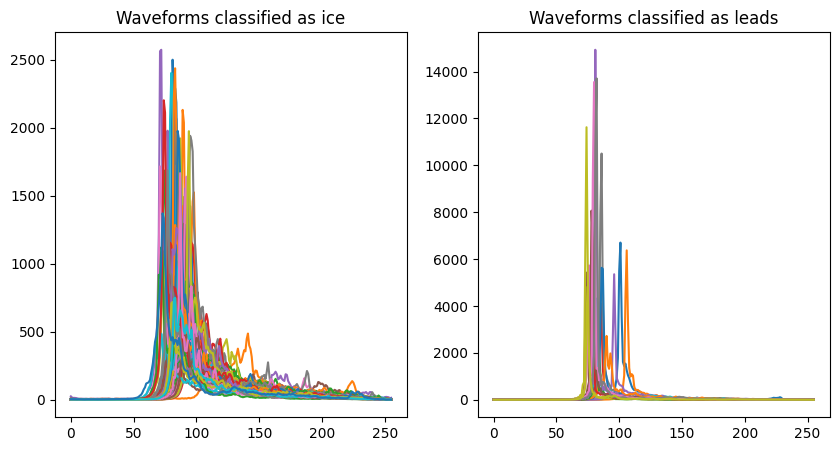

## AI for Earth Observation Assignment 4

### About this project

This notebook aims to classify echoes from sea ice and leads from Sentinel-3 altimetry data. We will use a Gaussian Matrix Model, an unsupervised machine learning technique, to achieve this. 

We find that the sea ice and lead echoes from the altimetry data can be effectively classified using this model, achieving an accuracy of 99% when compared with the official ESA classifications. A sample of the echo waveforms assigned to each classification is shown below. We also align the waveforms to achieve a more meaningful analysis.

### Getting started

`classifying_echoes.ipynb` contains the entirety of the code required to classify the Sentinel-3 altimetry date. Sample data are saved in the directory `data`.

This notebook is designed to run in Google Colab. Upload the `data` directory to your Google Drive, and replace `data_path` in the second cell in `classifying_echoes.ipynb` with the path to your saved directory. The entirety of the notebook should now run.
